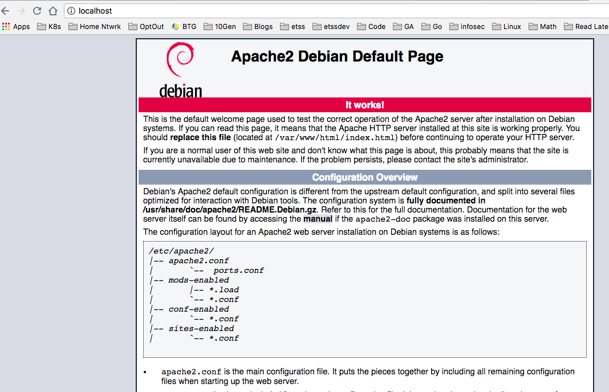

# Debian Dockerfile Example

Create a docker file

```docker
FROM debian:stable

RUN apt-get update && apt-get upgrade -y && apt-get install -y apache2 telnet elinks openssh-server

ENV MYVALUE my-value

EXPOSE 80

CMD ["usr/sbin/apache2ctl", "-D", "FOREGROUND"]
```

> cd /Users/cn/github/docker-quickstarts-bk/02_ImageCreationManagementRegistry/01_debian_apache

Build our container.  The '.' (period) says to use the local directly we are in to look for the Dockerfile.  Also, we can provide a specific with with the flag ' -f DockerfileTwo' now.

> docker build -t debian_apache .

> docker images

```bash
REPOSITORY                                 TAG                 IMAGE ID            CREATED             SIZE
debian_apache                              latest              9331f25e4c24        39 seconds ago      272MB
```

Run our container we just built.  We will map the container's port 80 to our localhost's port 80.

> docker run -d --name testweb -p 80:80 debian_apache

```bash
183d81c0a889d4fa7681788bb50551b0ae1096c19724e129ff59b47820812b68
```

Check to see if container is running.

> docker ps

```bash
CONTAINER ID        IMAGE               COMMAND                  CREATED             STATUS              PORTS                NAMES
183d81c0a889        debian_apache       "usr/sbin/apache2ctl…"   3 seconds ago       Up 2 seconds        0.0.0.0:80->80/tcp   testweb
```

> curl localhost

Or just http:\\localhost in your browser.




> docker exec -it debian_apache /bin/bash

> ps aux | grep http
root        79  0.0  0.0    544     4 pts/0    R+   15:37   0:00 grep http

> echo $MYVALUE
my-value